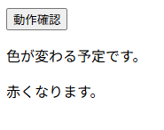
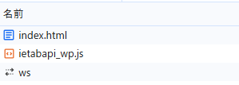
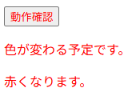
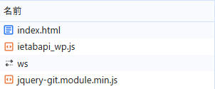

## 動作手順

- `ch15.01-03/ex02/index.html`をブラウザで開く

- 「動作確認」ボタンをクリックする。
  （このタイミングでは開発者ツールのネットワークタブには`jquery-git.module.min.js`がない）

- ページ内のすべてのテキストが赤色に変わることを確認する。
  (このタイミングでネットワークタブに`jquery-git.module.min.js`が表示され、動的インポートがされたことが確認できる)

