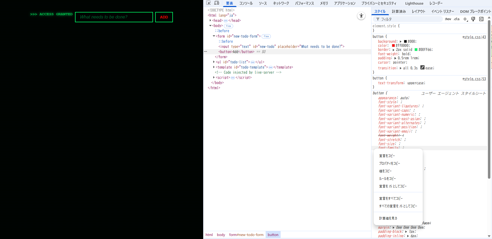

## 15.4-10.1 および 15.4-10.2 の ToDo アプリに対してブラウザの開発者ツールから値の変更やプロパティの追加を試してみなさい

ex01に対して以下を実施

- `button {text-transform: uppercase;}`を追加
- `button {color: #ff0000;}`に変更
  

## 2. 開発者ツールで CSS に関して実行できる操作を検索エンジンで調べ、便利だと思ったものを 3 つ挙げなさい

（参照 : https://developer.chrome.com/docs/devtools/css?hl=ja）

- [要素にCSS宣言を追加する](https://developer.chrome.com/docs/devtools/css?hl=ja#declarations)→どこにスタイルが追加されるか明確なため便利だと思いました。
- [要素にCSSクラスを追加する](https://developer.chrome.com/docs/devtools/css?hl=ja#classes)→チェックボックスで簡単にオン・オフが切り替えられて便利だと思いました。
- [要素のサイズを変更する](https://developer.chrome.com/docs/devtools/css?hl=ja#box-model)→サイズを簡単に変更でき、即座に確認できるため便利だと思いました。

## 15.4-10.2 のアプリの `body` 要素に対し、元々 HTML および JS 内で利用していなかった Tailwind CSS のクラス (`bg-rose-600` など何でも良い) を開発者ツールから追加すると変更が反映されないが、これは何故か調べなさい

```
Tailwind CSS v2.1 では、Tailwind CSS 用の新しいジャストインタイム コンパイラが導入されました。このコンパイラは、初期ビルド時にすべてを事前に生成するのではなく、テンプレートの作成時にオンデマンドでスタイルを生成します。
```

(参考:https://v2.tailwindcss.com/docs/just-in-time-mode?utm_source=chatgpt.com)

- HTML／JS／テンプレート上にそのクラス名が ビルド時に静的に見つからないと、CSS にそのユーティリティが生成されず、ブラウザが該当スタイルを持たない、という状態になるから
