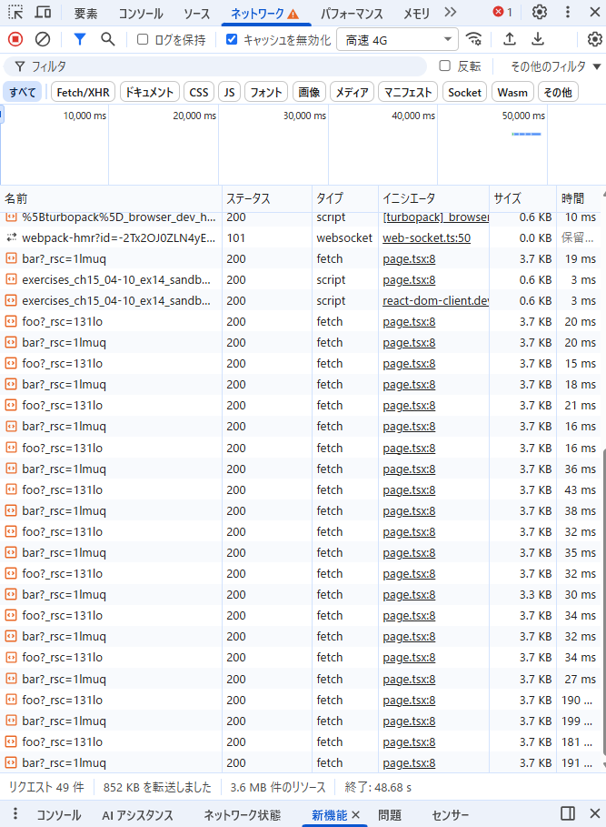

## 以下の動作を確認しなさい

### ブラウザの開発者ツールの「ネットワーク」タブを確認してみよう。リンクをクリックしたときに通信は発生しているだろうか？

- 発生している。
  

- RSC(React Server Component)とは、Reactのコンポーネントをサーバー上で実行し、その結果だけをクライアントに送る技術

[参考1](https://zenn.dev/kiwichan101kg/articles/0a51f8e912e4c8)
[参考2](https://note.com/happy_avocet7237/n/nf12aba5cb57f)

### pushState はいつ実行されているだろうか？

- Linkをクリックすることで、`pushState` が呼び出されている。(RSC取得前？)

### リロード時に画面の表示はどうなるだろうか？

- 開いていたページがそのまま表示される
- `http://localhost:3000/bar`でリロード→`http://localhost:3000/bar`が表示
- `http://localhost:3000/foo`でリロード→`http://localhost:3000/foo`が表示

## 1 で確認した動作と 15.4-10.12 で確認した動作を比較し、next.js の `Link` でどういった処理が行われているかをまとめなさい。

### 15.4-10.12 では

- pushStateでURLを変更
- JSで手動でUIを再描画

### Next.jsでは

- pushStateでURLを変更
- RSCをサーバーにリクエスト
- サーバーのRSCレンダリング結果を取得（RSC Payload）
- 必要ならそのページのJSバンドルも読み込む(動的import)
- ReactによってUIを差分適応する
