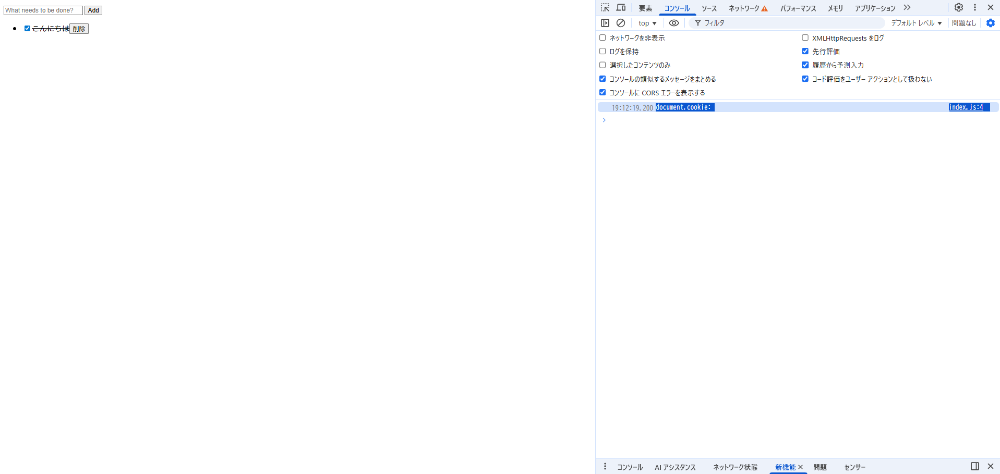
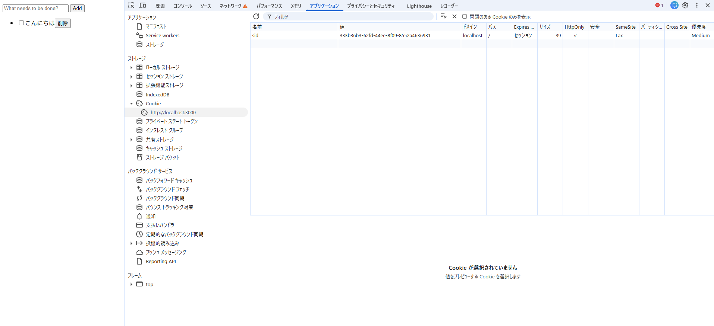

## index.js で`document.cookie` プロパティを `console.log`で表示する

以下を追加

```
console.log("document.cookie:", document.cookie);
```



- サーバ側で設定されているCookieにHttpOnlyが付いているため、JSからdocument.cookieにアクセスできない
  (参考)https://zenn.dev/mabo23/articles/e4b980e61a0d47

## ブラウザの開発者コンソールで http://localhost:3000/ の Cookie を表示する

- 表示された。ブラウザは Cookie の値を保持しているので、ツールを使えば閲覧可能。
  

## ToDo アプリのタブをリロードする

- タスクが消えずに表示される
- チェック状態も維持される
- 同じタブでCookieが同じなので、サーバは同じセッションを認識し同じ結果を返す。

## 同一ブラウザの異なるタブやウィンドウで http://localhost:3000/ を開いて ToDo リストの状態を確認する

- タスクが消えずに表示される
- チェック状態も維持される
- 同一ブラウザ・同一オリジンではCookieが共有される。そのため、サーバは同じセッションを認識し同じ結果を返す。

## シークレットウィンドウや異なるブラウザで http://localhost:3000/ を開いて ToDo リストの状態を確認する

- タスクが空になっている(chromeでタスクを追加して、シークレットモードやEdgeで開いた場合)
- シークレットや別ブラウザでは Cookie が新規作成され、別セッションとして扱われる

## http://127.0.0.1:3000/ を開いて ToDo リストの状態を確認する

- タスクが空になっている
- localhostと127.0.0.1では別のオリジン扱いになっている。
