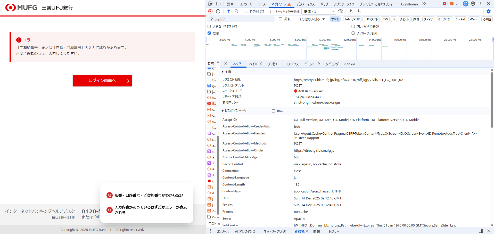

# 実際のサービスの通信をデベロッパーツールなどで眺めて CORS の設定を確認しなさい。

## CORS の設定

`accept-ch : UA-Full-Version, UA-Arch, UA-Model, UA-Platform, UA-Platform-Version, UA-Mobile`

- 次回以降のリクエストで、どの端末情報を送ってほしいかを指示する仕組み
- 不正アクセス・ボット対策に利用されることが多い

`access-control-allow-credentials : true`

- Cookie / 認証情報の送信を許可

`access-control-allow-methods : POST`

- POST メソッドのみ許可
- 機密情報を扱うため、URLに情報が残るGETを使わせない(パラメータが URL に含まれるから)

`access-control-allow-origin : https://directg.s.bk.mufg.jp`

- このオリジンからのアクセスのみ許可

`access-control-max-age : 600`

- Preflight（OPTIONS）リクエストの結果をブラウザがどれくらいキャッシュしてよいかを指定するヘッダ
- 600秒なので10分
