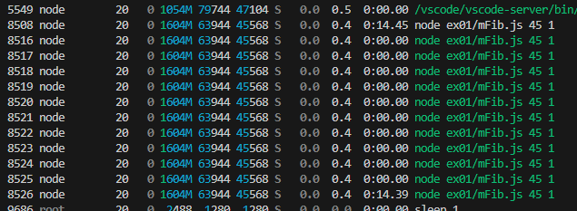
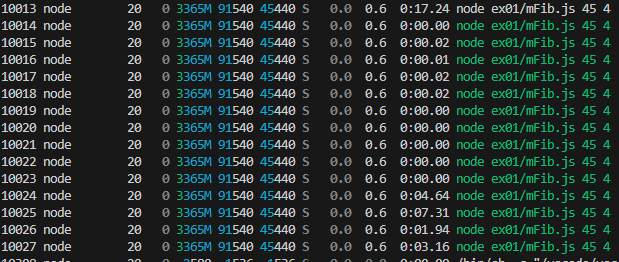
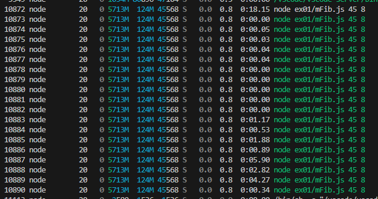

## 用語「マルチスレッド」について調べなさい。

- マルチスレッドとは、一つのコンピュータープログラムを実行する際に、アプリケーションのプロセス（タスク）を複数のスレッドに分けて並行処理する流れのこと。
- マルチスレッドを用いると、プロセス内で複数の処理を同時に行なうため、処理速度と精度が飛躍的に向上する。
- スレッド間のメモリ共有が行われる。

（参考）https://business.ntt-west.co.jp/glossary/words-00262.html

## 次にフィボナッチ数を計算するmFib.jsをスレッド数を変更しながら実行し(*1)、コンソール出力とOS機能(*2)で結果とスレッド数を確認しなさい。

htopを利用して確認した。
(参考)https://qiita.com/akiralab/items/439c5e2c2dc33e4fe0ce

### node mFib.js 45 1

- コンソール出力

```
Worker 0 execution time: 14.426s
Total execution time: 14.430s
Fibonacci number: 1836311902
```

- OS機能
  

### node mFib.js 45 4

- コンソール出力

```
Worker 2 execution time: 1.947s
Worker 3 execution time: 3.162s
Worker 0 execution time: 4.642s
Worker 1 execution time: 7.326s
Total execution time: 7.330s
Fibonacci number: 1836311902
```

- OS機能
  

### node mFib.js 45 8

- コンソール出力

```
Worker 7 execution time: 335.851ms
Worker 1 execution time: 524.169ms
Worker 3 execution time: 891.249ms
Worker 0 execution time: 1.173s
Worker 2 execution time: 1.884s
Worker 5 execution time: 2.813s
Worker 6 execution time: 4.274s
Worker 4 execution time: 5.901s
Total execution time: 5.906s
Fibonacci number: 1836311902
```

- OS機能
  

## 最後にあなたのPCのCPUスペックを調査し、適切なスレッド数についての考察を記しなさい。

- CPUスペック(lscpuで確認)

```
CPU(s): 14
Core(s) per socket: 7
Thread(s) per core: 2
Socket(s):          1
```

論理コア数が14のため、同時に実行可能な処理数の上限は14である。
また、物理コア数が7であり、1物理コアあたりの論理コア数が2のため、7~14のスレッド数が適切と考える。
(参考)https://zenn.dev/linux/articles/14087a48f9ffe9
