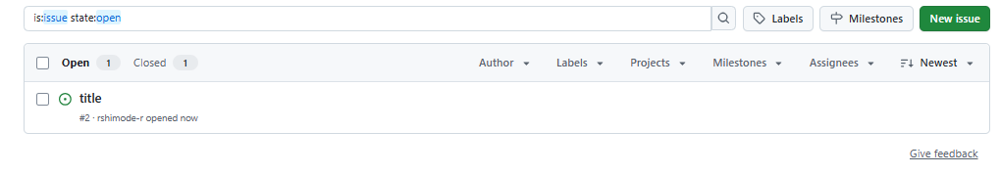
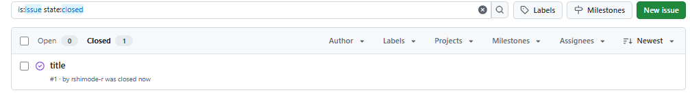

## issue作成

```
node index.js create rshimode-r JavaScript-shimode title body
```



## Issueのクローズ

```
node index.js close rshimode-r JavaScript-shimode 1
```



## オープンな Issue の Id と Title の一覧を表示できる

```
node index.js list rshimode-r JavaScript-shimode
```

- 出力

```
#2: title
```

## `-h`または`--help`オプションで使い方が確認できる

```
node index.js -h

GitHub Issue CLI
Usage:
  node index.js create <owner> <repo> <title> [body]   Create a new Issue
  node index.js close <owner> <repo> <issue_number>   Close an Issue
  node index.js list <owner> <repo>                  List open Issues
Options:
  -h, --help      Show this help
  -v, --verbose   Show HTTP requests
```

## `-v`または`--verbose`オプションで HTTP ログを出力する

```
node index.js -v create rshimode-r JavaScript-shimode title body

POST https://api.github.com/repos/rshimode-r/JavaScript-shimode/issues { title: 'title', body: 'body' }
Created Issue #3: title
```

(参考)https://docs.github.com/ja/rest/issues?apiVersion=2022-11-28
