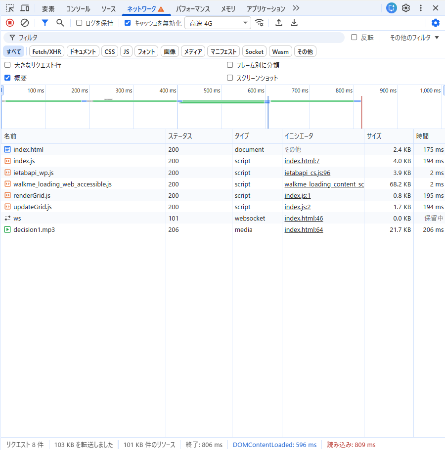
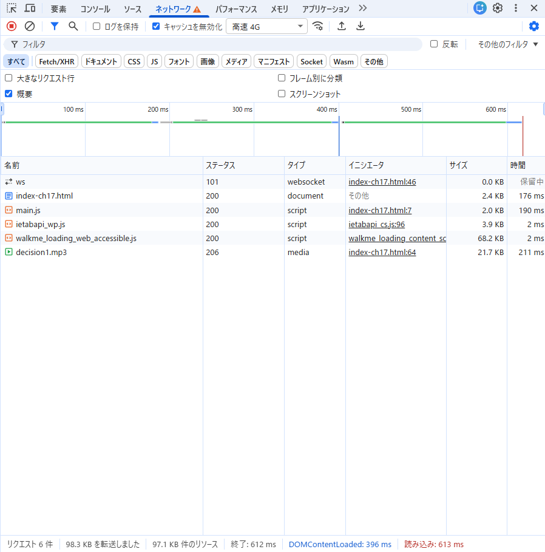

## 実施したこと

webpack.config.jsを作成し、以下のコマンドでproductionモードでビルドした。

```
npx webpack --config webpack.config.js
```

また、index-ch17.htmlを新たに作成した。

```
<script src="main.js"></script>
```

## バンドルしたコードと元のコードを比較し、どのような処理が行われたかを確認しなさい。

- 元のコードでは`index.js`と`updateGrid.js`, `renderGrid.js`が別ファイルとなっているが、バンドルした後は1つのファイルでまとめられている。

- 一行でまとめられている。

- ファイルサイズを調べたところ、`index.js`が3,554 バイト、`updateGrid.js`が1,301 バイト、 `renderGrid.js`が415 バイトなのに対し、`main.js`は1,634 バイトとなっており圧縮されていることが分かる。

## 開発者ツールで `ネットワーク` タブを開き、スクリプトのダウンロード時間、ページの読み込み完了時間について比較しなさい。

- バンドル前
  - index.js: 194ms
  - renderGrid.js: 195ms
  - updateGrid.js: 194ms
  - 読み込み完了: 809ms



- バンドル後
  - main.js: 190ms
  - 読み込み完了: 613ms


