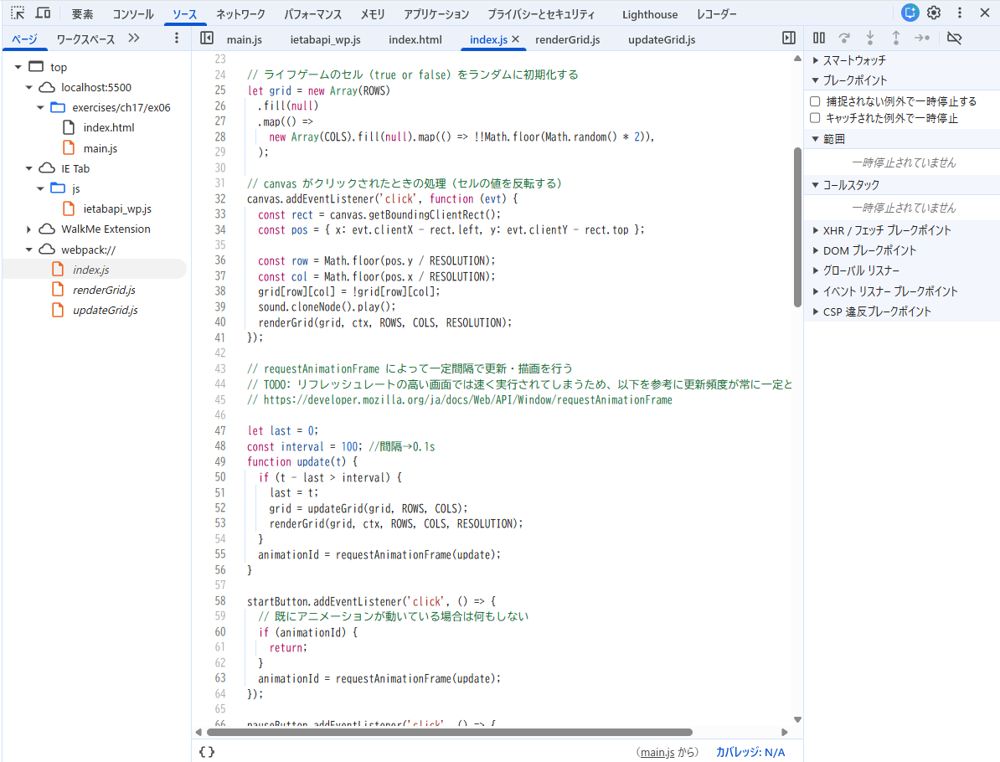

## 開発者ツールで `ソース` タブ(Chrome, Edge, Safari) または `デバッガー` タブ(Firefox) を開き、ソースコードファイルがどのように表示されるかを確認しなさい。

- chromeにて確認
  webpackの中に元のファイルのコードが表示された

## バンドルしたコードの実行中に、バンドル前のソースコードファイルに基づいたブレークポイントの設定や変数の値の確認等のデバッグが可能か確認しなさい。

- ブレークポイントの設定や変数の値の確認は可能である。

(参考)https://developer.chrome.com/docs/devtools/javascript/breakpoints?hl=ja
